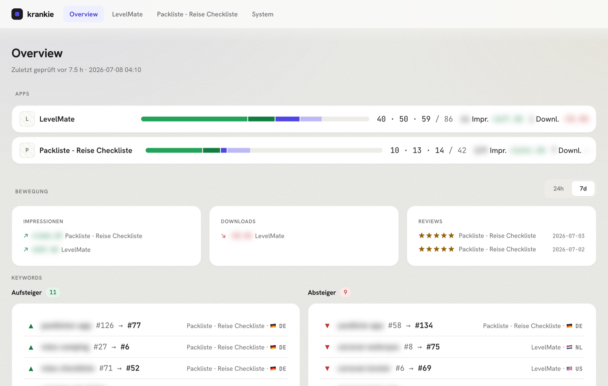
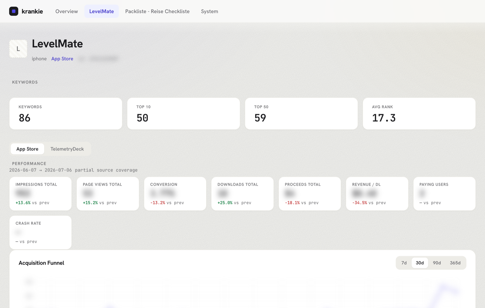
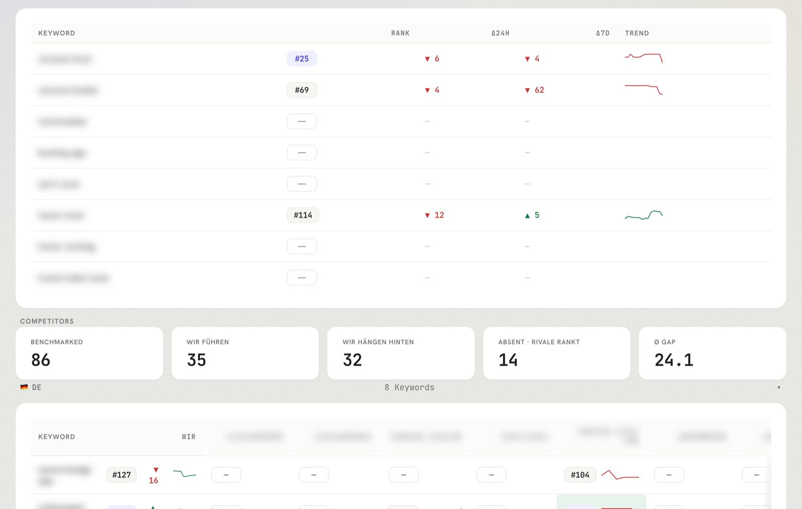

# krankie-dashboard

[](https://github.com/DerRemo/krankie-dashboard/actions/workflows/ci.yml)
[](LICENSE)

A web dashboard for [krankie](https://github.com/timbroddin/krankie) keyword-rank data.



krankie-dashboard is a read-mostly web UI over the SQLite database that [krankie](https://github.com/timbroddin/krankie) already keeps on your machine. It turns that local database into browsable overview, app-detail, keyword-history, and store-comparison views, and can optionally layer in App Store Connect (downloads, revenue, reviews) and TelemetryDeck (engagement) data. It's built for indie iOS developers who already track their App Store keyword rankings with krankie and want a nicer way to look at the numbers. Run it once and it serves at `http://<host>.local:3737` (or `http://localhost:3737`).

## Prerequisites

- **macOS** — the production setup uses `launchd` LaunchAgents and mDNS `.local` hostnames, so this only runs on a Mac.
- [**Bun**](https://bun.sh) — the JavaScript runtime this project is built and run with.
- [**krankie**](https://github.com/timbroddin/krankie) — the keyword-rank tracker whose SQLite database this dashboard reads. Required.
- [**`asc`**](https://asccli.sh/) — the App Store Connect CLI. Optional; only needed if you want the downloads/revenue/reviews features.

## Quickstart

Try it out locally before setting up the always-on production install:

```bash
git clone https://github.com/DerRemo/krankie-dashboard.git
cd krankie-dashboard
bun install
cp .env.example .env

# one-time: WAL mode so dashboard reads don't block krankie writes
sqlite3 ~/.krankie/krankie.db "PRAGMA journal_mode=WAL"

bun run build:client   # builds public/client.js
bun run dev            # serves on http://localhost:3737
```

## Screenshots





## Production (always-on Mac)

For day-to-day use, install the dashboard as a `launchd` LaunchAgent on an always-on Mac so it starts at login and stays up:

```bash
bun run build              # builds client + compiles server binary
bun run install:agent      # installs LaunchAgent, auto-starts at login
bun run reload             # rebuild + kickstart agent
bun run uninstall:agent    # removes the agent
```

After install: reachable at `http://<host>.local:3737`. Logs land at `~/Library/Logs/krankie-dashboard/`.

## Configuration

Defaults are set so you do not need an `.env` file. Override via env vars:

| Variable      | Default                               |
|---------------|---------------------------------------|
| `PORT`        | `3737`                                |
| `KRANKIE_BIN` | `krankie` (resolved on PATH)          |
| `KRANKIE_DB`  | `~/.krankie/krankie.db`               |
| `LOG_LEVEL`   | `info` (`debug`/`info`/`warn`/`error`)|
| `HOSTNAME`    | `krankie.local`                       |

## App Store Connect (optional)

The dashboard can pull App Store Connect Sales/Trends and Analytics data alongside krankie's keyword rankings. Without these env vars, ASC routes return empty and the System Status page shows "ASC API not configured" — the rest of the dashboard works as before.

1. **Create an ASC API key** in App Store Connect → Users and Access → Keys → "+". Role: Sales / Finance / App Manager (read-only is sufficient). Download the `.p8` file (you only get one chance).
2. **Find your Vendor Number** in ASC → Payments and Financial Reports → top-right.
3. Save the key and configure `.env`:

   ```bash
   mkdir -p ~/.krankie-dashboard
   mv ~/Downloads/AuthKey_XXXXXXXXXX.p8 ~/.krankie-dashboard/
   chmod 600 ~/.krankie-dashboard/AuthKey_XXXXXXXXXX.p8
   ```

   ```env
   ASC_ISSUER_ID=<UUID from ASC > Keys page>
   ASC_KEY_ID=<10-character Key ID>
   ASC_PRIVATE_KEY_PATH=$HOME/.krankie-dashboard/AuthKey_XXXXXXXXXX.p8
   ASC_VENDOR_NUMBER=<numeric>
   ```

4. Re-install the launchd agents so the daily 06:00 sync activates:

   ```bash
   bun run install:agent
   ```

5. Trigger an initial sync from the System Status page ("Sync now") or run on the CLI: `./dist/krankie-dashboard --asc-sync`.
6. The first Analytics backfill (`ONE_TIME_SNAPSHOT`) trickles in over multiple days — Apple processes historical snapshot data asynchronously. Sales/Trends backfill completes in ~2 minutes.

ASC sync logs land at `~/Library/Logs/krankie-dashboard/asc-sync-{stdout,stderr}.log`.

## TelemetryDeck (optional)

The dashboard can pull engagement, custom-event, and breakdown data from TelemetryDeck alongside ASC data.

1. Create an API token at <https://telemetrydeck.com/api-tokens>.
2. Add to `.env`:
   ```env
   TELEMETRYDECK_API_TOKEN=tdt_yourtoken
   ```
3. Re-install the LaunchAgent so the hourly TD sync activates:
   ```bash
   bun run install:agent
   ```

   Set the token **before** running the install so the `td-sync` LaunchAgent picks it up. The agent installs unconditionally either way — without the token, the hourly job exits immediately (harmless), and the `/system` page shows the TD card in an unconfigured state.

4. Trigger an initial sync:
   ```bash
   bun run td:sync
   ```

The sync writes to `~/.krankie-dashboard/td.db`. The dashboard reads it alongside `asc.db` and joins them in the funnel view via SQLite ATTACH.

TD apps are auto-matched to krankie/ASC apps via bundle identifier (discovered from TD signals' `payload.appBundle`) or, as a fallback, via fuzzy name match. To see unmatched apps and pin manual mappings, visit `/system` or run `bun run td:remap` to re-evaluate auto-matches.

## Architecture

Short version:

- **Stack:** Bun + Hono, server-rendered JSX, tiny client JS.
- **Data:** direct read-only SQLite reads (`bun:sqlite`), shell-out for `krankie check run` and `asc`.

## Troubleshooting

- *dashboard says "krankie db unreachable"* → check `~/.krankie/krankie.db` exists. Run `bunx krankie info` to inspect.
- *check button is disabled* → krankie binary missing on `PATH`. Set `KRANKIE_BIN` in `.env`.
- *read-locking issues during a check run* → set WAL mode (one-time, see Quickstart).

## License

MIT — see [LICENSE](LICENSE).
